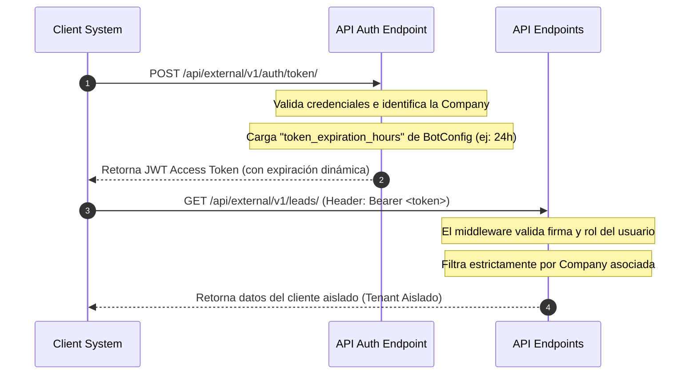

# SmartWorker - API Externa V1 (Multi-Tenant)

Esta es la documentación técnica y de integración para la **API Externa V1** de SmartWorker en **Leads Portal**.

Esta API permite a los clientes finales y sistemas externos conectarse para consultar, crear, actualizar y gestionar información en tiempo real, garantizando el aislamiento absoluto de datos entre inquilinos (Tenant Isolation) a nivel de base de datos (`company`).

---

## 🏗️ Flujo de Arquitectura y Autenticación

El acceso a los endpoints de la API externa está restringido y requiere un token de acceso JWT (JSON Web Token) válido, que se obtiene mediante credenciales de usuario de tipo cliente/administrador de la compañía.



---

## 📡 Puerto y Entornos de Ejecución

*   **Puerto del Contenedor Backend**: `8000` (interno)
*   **Puerto de Acceso Externo (Host)**: `8900`
*   **Base URL (Desarrollo/Local)**: `http://localhost:8900/api`
*   **Base URL (Producción)**: `https://api.smartworker.work/api` (detrás de Proxy inverso SSL)

---

## 🔒 Configuración de la Expiración del Token

El tiempo de ciclo de vida del Access Token se gestiona dinámicamente:
1.  Un administrador ingresa a **Ajustes** -> **API Externa y Tokens** en la aplicación web.
2.  Define la duración del token en horas utilizando el control deslizante interactivo (desde 1 hora hasta 720 horas / 30 días).
3.  Al autenticarse mediante `/auth/token/`, el backend consulta el `BotConfig` de la compañía del usuario e inyecta la duración configurada en la expiración (`exp`) del JWT.
4.  *Fallback*: Si la empresa no tiene una duración configurada, se aplica el valor por defecto de **24 horas**.

---

## 📂 Suite de Pruebas Automatizadas Integrado (`/api/leads/test/`)

Para facilitar las pruebas y la auditoría rápida del estado de integración sin necesidad de herramientas como Postman, hemos creado un suite de pruebas automatizado directamente en el backend:

*   **Ruta**: `GET /api/leads/test/`
*   **Autenticación**: Requiere que la petición esté autenticada en el navegador o mediante token.
*   **Funcionamiento**: Simula llamadas REST Framework internas (utilizando `APIRequestFactory`) a todos los endpoints externos utilizando el contexto del usuario autenticado.
*   **Resultado**: Devuelve un JSON detallado con el estado de cada test (`PASSED` o `FAILED`), los códigos de estado HTTP correspondientes, la cantidad de registros encontrados y una vista previa (`data_preview`) de los primeros registros de la base de datos para verificar visualmente que el formato de salida sea el correcto.

---

## 🛤️ Tabla Completa de Endpoints

### 1. Autenticación (POST)
*   **Ruta**: `/api/external/v1/auth/token/`
*   **Descripción**: Genera el JWT Access Token basado en credenciales del usuario.
*   **Payload (JSON)**:
    ```json
    {
      "username": "tu_usuario",
      "password": "tu_contraseña"
    }
    ```
*   **Comando de Prueba**:
    ```bash
    curl -X POST "http://localhost:8900/api/external/v1/auth/token/" \
      -H "Content-Type: application/json" \
      -d '{"username": "usuario_cliente", "password": "password_seguro"}'
    ```

---

## 📦 2. Leads de Clientes (CRUD Completo)

### 2.1 Listar Leads
*   **Ruta**: `GET /api/external/v1/leads/`
*   **Descripción**: Lista todos los leads asignados a la compañía (paginados, 10 por página).
*   **Filtros opcionales**: `?search=juan`, `?status=calificado`, `?is_processed=true`
*   **Comando**:
    ```bash
    curl -X GET "http://localhost:8900/api/external/v1/leads/" \
      -H "Authorization: Bearer <TU_JWT_TOKEN>"
    ```

### 2.2 Crear Lead
*   **Ruta**: `POST /api/external/v1/leads/`
*   **Descripción**: Registra un nuevo lead en la compañía.
*   **Payload (JSON)**:
    ```json
    {
      "first_name": "Juan",
      "last_name": "Perez",
      "phone": "+584121234567",
      "email": "juan@email.com",
      "status": "nuevo",
      "score": 75,
      "user_identification": "V-12345678",
      "address": "Av. Principal, Caracas"
    }
    ```
*   **Comando**:
    ```bash
    curl -X POST "http://localhost:8900/api/external/v1/leads/" \
      -H "Authorization: Bearer <TU_JWT_TOKEN>" \
      -H "Content-Type: application/json" \
      -d '{
        "first_name": "Juan",
        "last_name": "Perez",
        "phone": "+584121234567",
        "status": "nuevo",
        "score": 75
      }'
    ```

### 2.3 Actualizar Lead (PUT/PATCH)
*   **Ruta**: `PUT /api/external/v1/leads/{id}/` o `PATCH /api/external/v1/leads/{id}/`
*   **Descripción**: Actualiza los datos de un lead existente.
*   **Payload (JSON)**:
    ```json
    {
      "status": "calificado",
      "score": 90,
      "email": "juan.nuevo@email.com"
    }
    ```
*   **Comando**:
    ```bash
    curl -X PATCH "http://localhost:8900/api/external/v1/leads/<LEAD_ID>/" \
      -H "Authorization: Bearer <TU_JWT_TOKEN>" \
      -H "Content-Type: application/json" \
      -d '{"status": "calificado", "score": 90}'
    ```

### 2.4 Eliminar Lead (Soft-Delete)
*   **Ruta**: `DELETE /api/external/v1/leads/{id}/`
*   **Descripción**: Marca el lead como eliminado lógicamente (`deleted_at`). No desaparece de la BD pero no aparece en listados.
*   **Comando**:
    ```bash
    curl -X DELETE "http://localhost:8900/api/external/v1/leads/<LEAD_ID>/" \
      -H "Authorization: Bearer <TU_JWT_TOKEN>"
    ```

### 2.5 Marcar como Procesado
*   **Ruta**: `POST /api/external/v1/leads/{id}/mark_processed/`
*   **Descripción**: Marca el lead con `is_processed=True` (sincronizado con ERP externo).
*   **Comando**:
    ```bash
    curl -X POST "http://localhost:8900/api/external/v1/leads/<LEAD_ID>/mark_processed/" \
      -H "Authorization: Bearer <TU_JWT_TOKEN>"
    ```

### 2.6 Cambiar Status
*   **Ruta**: `POST /api/external/v1/leads/{id}/change_status/`
*   **Descripción**: Cambia el status del lead con validación de valores permitidos.
*   **Payload (JSON)**:
    ```json
    {
      "status": "vendido"
    }
    ```
*   **Comando**:
    ```bash
    curl -X POST "http://localhost:8900/api/external/v1/leads/<LEAD_ID>/change_status/" \
      -H "Authorization: Bearer <TU_JWT_TOKEN>" \
      -H "Content-Type: application/json" \
      -d '{"status": "vendido"}'
    ```
*   **Status válidos**: `nuevo`, `en_conversacion`, `calificado`, `cliente`, `descartado`, `bloqueado`, `vendido`

### 2.7 Detalle de Lead
*   **Ruta**: `GET /api/external/v1/leads/{id}/`
*   **Comando**:
    ```bash
    curl -X GET "http://localhost:8900/api/external/v1/leads/<LEAD_ID>/" \
      -H "Authorization: Bearer <TU_JWT_TOKEN>"
    ```

---

## 🛒 3. Órdenes de Compra (CRUD Completo)

### 3.1 Listar Órdenes
*   **Ruta**: `GET /api/external/v1/orders/`
*   **Filtros**: `?search=Juan`, `?status=PENDIENTE`, `?is_processed=false`
*   **Comando**:
    ```bash
    curl -X GET "http://localhost:8900/api/external/v1/orders/" \
      -H "Authorization: Bearer <TU_JWT_TOKEN>"
    ```

### 3.2 Crear Orden
*   **Ruta**: `POST /api/external/v1/orders/`
*   **Payload (JSON)**:
    ```json
    {
      "customer_name": "Juan Perez",
      "identification": "V-12345678",
      "address": "Av. Principal, Caracas",
      "summary": "2x Producto A, 1x Producto B. Total: $50.00",
      "status": "PENDIENTE"
    }
    ```
*   **Comando**:
    ```bash
    curl -X POST "http://localhost:8900/api/external/v1/orders/" \
      -H "Authorization: Bearer <TU_JWT_TOKEN>" \
      -H "Content-Type: application/json" \
      -d '{
        "customer_name": "Juan Perez",
        "identification": "V-12345678",
        "address": "Av. Principal, Caracas",
        "summary": "2x Producto A, 1x Producto B. Total: $50.00",
        "status": "PENDIENTE"
      }'
    ```

### 3.3 Actualizar Orden (PUT/PATCH)
*   **Ruta**: `PUT /api/external/v1/orders/{id}/` o `PATCH /api/external/v1/orders/{id}/`
*   **Descripción**: Actualiza una orden. **Si cambia el status, dispara notificación atómica por WhatsApp** (rollback si falla el envío).
*   **Payload (JSON)**:
    ```json
    {
      "status": "PROCESADO",
      "reference_number": "REF-2024-001"
    }
    ```
*   **Comando**:
    ```bash
    curl -X PATCH "http://localhost:8900/api/external/v1/orders/<ORDER_ID>/" \
      -H "Authorization: Bearer <TU_JWT_TOKEN>" \
      -H "Content-Type: application/json" \
      -d '{"status": "PROCESADO", "reference_number": "REF-2024-001"}'
    ```

### 3.4 Eliminar Orden (Soft-Delete)
*   **Ruta**: `DELETE /api/external/v1/orders/{id}/`
*   **Comando**:
    ```bash
    curl -X DELETE "http://localhost:8900/api/external/v1/orders/<ORDER_ID>/" \
      -H "Authorization: Bearer <TU_JWT_TOKEN>"
    ```

### 3.5 Marcar como Procesado
*   **Ruta**: `POST /api/external/v1/orders/{id}/mark_processed/`
*   **Comando**:
    ```bash
    curl -X POST "http://localhost:8900/api/external/v1/orders/<ORDER_ID>/mark_processed/" \
      -H "Authorization: Bearer <TU_JWT_TOKEN>"
    ```

### 3.6 Cambiar Status
*   **Ruta**: `POST /api/external/v1/orders/{id}/change_status/`
*   **Payload (JSON)**:
    ```json
    {
      "status": "PROCESADO"
    }
    ```
*   **Comando**:
    ```bash
    curl -X POST "http://localhost:8900/api/external/v1/orders/<ORDER_ID>/change_status/" \
      -H "Authorization: Bearer <TU_JWT_TOKEN>" \
      -H "Content-Type: application/json" \
      -d '{"status": "PROCESADO"}'
    ```
*   **Status válidos**: `PENDIENTE`, `PROCESADO`, `CANCELADO`
*   **Nota**: Si el status cambia a `PROCESADO` o `CANCELADO`, se envía notificación por WhatsApp al cliente. Si el envío falla, la transacción se revierte (rollback).

### 3.7 Detalle de Orden
*   **Ruta**: `GET /api/external/v1/orders/{id}/`

---

## 📜 4. Cotizaciones y Proyectos (CRUD Completo)

### 4.1 Listar Cotizaciones
*   **Ruta**: `GET /api/external/v1/quotes/`
*   **Filtros**: `?search=Juan`, `?status=ACEPTADA`, `?is_processed=false`

### 4.2 Crear Cotización
*   **Ruta**: `POST /api/external/v1/quotes/`
*   **Payload (JSON)**:
    ```json
    {
      "customer_name": "Juan Perez",
      "whatsapp_number": "+584121234567",
      "technical_requirements": "Requiere sistema de climatización para oficina de 100m²",
      "items_requested": [{"sku": "AC-001", "name": "Aire Cond. 12000 BTU", "quantity": 2}],
      "budget_estimated": 1500.00,
      "status": "BORRADOR_IA"
    }
    ```

### 4.3 Actualizar Cotización (PUT/PATCH)
*   **Ruta**: `PUT /api/external/v1/quotes/{id}/` o `PATCH /api/external/v1/quotes/{id}/`
*   **Descripción**: Actualiza una cotización. **Si cambia el status a ENVIADA/ACEPTADA/RECHAZADA/FINALIZADA, dispara notificación resiliente por WhatsApp** (no rollback si falla).
*   **Payload (JSON)**:
    ```json
    {
      "status": "ENVIADA",
      "technical_requirements": "Requerimientos actualizados...",
      "budget_estimated": 1800.00
    }
    ```
*   **Comando**:
    ```bash
    curl -X PATCH "http://localhost:8900/api/external/v1/quotes/<QUOTE_ID>/" \
      -H "Authorization: Bearer <TU_JWT_TOKEN>" \
      -H "Content-Type: application/json" \
      -d '{"status": "ENVIADA", "budget_estimated": 1800.00}'
    ```

### 4.4 Eliminar Cotización (Soft-Delete)
*   **Ruta**: `DELETE /api/external/v1/quotes/{id}/`

### 4.5 Marcar como Procesado
*   **Ruta**: `POST /api/external/v1/quotes/{id}/mark_processed/`

### 4.6 Cambiar Status
*   **Ruta**: `POST /api/external/v1/quotes/{id}/change_status/`
*   **Payload (JSON)**:
    ```json
    {
      "status": "ACEPTADA"
    }
    ```
*   **Comando**:
    ```bash
    curl -X POST "http://localhost:8900/api/external/v1/quotes/<QUOTE_ID>/change_status/" \
      -H "Authorization: Bearer <TU_JWT_TOKEN>" \
      -H "Content-Type: application/json" \
      -d '{"status": "ACEPTADA"}'
    ```
*   **Status válidos**: `BORRADOR_IA`, `PENDIENTE_VENDEDOR`, `ENVIADA`, `ACEPTADA`, `RECHAZADA`, `FINALIZADA`

### 4.7 Detalle de Cotización
*   **Ruta**: `GET /api/external/v1/quotes/{id}/`

---

## 🎫 5. Tickets de Soporte (CRUD Completo)

### 5.1 Listar Tickets
*   **Ruta**: `GET /api/external/v1/bot-supports/`
*   **Filtros**: `?search=Juan`, `?status=ABIERTO`, `?is_processed=false`

### 5.2 Crear Ticket
*   **Ruta**: `POST /api/external/v1/bot-supports/`
*   **Payload (JSON)**:
    ```json
    {
      "whatsapp_number": "+584121234567",
      "customer_name": "Juan Perez",
      "identification": "V-12345678",
      "address": "Av. Principal, Caracas",
      "summary": "El cliente reporta que su pedido no ha llegado después de 5 días.",
      "status": "ABIERTO"
    }
    ```

### 5.3 Actualizar Ticket (PUT/PATCH)
*   **Ruta**: `PUT /api/external/v1/bot-supports/{id}/` o `PATCH /api/external/v1/bot-supports/{id}/`
*   **Descripción**: Actualiza un ticket. **Si cambia el status, dispara notificación atómica por WhatsApp** (rollback si falla).
*   **Payload (JSON)**:
    ```json
    {
      "status": "EN_PROCESO",
      "summary": "Ticket tomado por asesor Carlos. En proceso de resolución."
    }
    ```
*   **Comando**:
    ```bash
    curl -X PATCH "http://localhost:8900/api/external/v1/bot-supports/<SUPPORT_ID>/" \
      -H "Authorization: Bearer <TU_JWT_TOKEN>" \
      -H "Content-Type: application/json" \
      -d '{"status": "EN_PROCESO", "summary": "Ticket tomado por asesor Carlos."}'
    ```

### 5.4 Eliminar Ticket (Soft-Delete)
*   **Ruta**: `DELETE /api/external/v1/bot-supports/{id}/`

### 5.5 Marcar como Procesado
*   **Ruta**: `POST /api/external/v1/bot-supports/{id}/mark_processed/`

### 5.6 Cambiar Status
*   **Ruta**: `POST /api/external/v1/bot-supports/{id}/change_status/`
*   **Payload (JSON)**:
    ```json
    {
      "status": "RESUELTO"
    }
    ```
*   **Comando**:
    ```bash
    curl -X POST "http://localhost:8900/api/external/v1/bot-supports/<SUPPORT_ID>/change_status/" \
      -H "Authorization: Bearer <TU_JWT_TOKEN>" \
      -H "Content-Type: application/json" \
      -d '{"status": "RESUELTO"}'
    ```
*   **Status válidos**: `ABIERTO`, `EN_PROCESO`, `RESUELTO`
*   **Nota**: Si el status cambia a `EN_PROCESO` o `RESUELTO`, se envía notificación por WhatsApp al cliente. Si el envío falla, la transacción se revierte.

### 5.7 Detalle de Ticket
*   **Ruta**: `GET /api/external/v1/bot-supports/{id}/`

---

## 🚚 6. Tickets de Delivery / Entregas (CRUD Completo)

### 6.1 Listar Tickets de Delivery
*   **Ruta**: `GET /api/external/v1/delivery-tickets/`
*   **Filtros**: `?search=Juan`, `?status=EN_CAMINO`, `?is_processed=false`

### 6.2 Crear Ticket de Delivery
*   **Ruta**: `POST /api/external/v1/delivery-tickets/`
*   **Payload (JSON)**:
    ```json
    {
      "customer_name": "Juan Perez",
      "whatsapp_number": "+584121234567",
      "address": "Av. Principal, Caracas",
      "summary": "Pedido #123 - 2x Producto A, 1x Producto B",
      "latitude": 10.4806,
      "longitude": -66.9036,
      "status": "PENDIENTE"
    }
    ```

### 6.3 Actualizar Ticket de Delivery (PUT/PATCH)
*   **Ruta**: `PUT /api/external/v1/delivery-tickets/{id}/` o `PATCH /api/external/v1/delivery-tickets/{id}/`
*   **Descripción**: Actualiza un ticket de delivery. **Si cambia el status, dispara notificación atómica por WhatsApp** (rollback si falla).
*   **Payload (JSON)**:
    ```json
    {
      "status": "EN_CAMINO"
    }
    ```
*   **Comando**:
    ```bash
    curl -X PATCH "http://localhost:8900/api/external/v1/delivery-tickets/<DELIVERY_ID>/" \
      -H "Authorization: Bearer <TU_JWT_TOKEN>" \
      -H "Content-Type: application/json" \
      -d '{"status": "EN_CAMINO"}'
    ```

### 6.4 Eliminar Ticket de Delivery (Soft-Delete)
*   **Ruta**: `DELETE /api/external/v1/delivery-tickets/{id}/`

### 6.5 Marcar como Procesado
*   **Ruta**: `POST /api/external/v1/delivery-tickets/{id}/mark_processed/`

### 6.6 Cambiar Status
*   **Ruta**: `POST /api/external/v1/delivery-tickets/{id}/change_status/`
*   **Payload (JSON)**:
    ```json
    {
      "status": "ENTREGADO"
    }
    ```
*   **Comando**:
    ```bash
    curl -X POST "http://localhost:8900/api/external/v1/delivery-tickets/<DELIVERY_ID>/change_status/" \
      -H "Authorization: Bearer <TU_JWT_TOKEN>" \
      -H "Content-Type: application/json" \
      -d '{"status": "ENTREGADO"}'
    ```
*   **Status válidos**: `PENDIENTE`, `EN_CAMINO`, `ENTREGADO`, `CANCELADO`
*   **Nota**: Si el status cambia a `EN_CAMINO`, `ENTREGADO` o `CANCELADO`, se envía notificación por WhatsApp al cliente. Si el envío falla, la transacción se revierte.

### 6.7 Detalle de Ticket de Delivery
*   **Ruta**: `GET /api/external/v1/delivery-tickets/{id}/`

---

## 📋 Resumen Rápido de Endpoints

| Recurso | GET (lista) | GET (detalle) | POST (crear) | PUT/PATCH | DELETE | mark_processed | change_status |
|---|---|---|---|---|---|---|---|
| **Leads** | `/leads/` | `/leads/{id}/` | `/leads/` | `/leads/{id}/` | `/leads/{id}/` | `/leads/{id}/mark_processed/` | `/leads/{id}/change_status/` |
| **Orders** | `/orders/` | `/orders/{id}/` | `/orders/` | `/orders/{id}/` | `/orders/{id}/` | `/orders/{id}/mark_processed/` | `/orders/{id}/change_status/` |
| **Quotes** | `/quotes/` | `/quotes/{id}/` | `/quotes/` | `/quotes/{id}/` | `/quotes/{id}/` | `/quotes/{id}/mark_processed/` | `/quotes/{id}/change_status/` |
| **Bot-Supports** | `/bot-supports/` | `/bot-supports/{id}/` | `/bot-supports/` | `/bot-supports/{id}/` | `/bot-supports/{id}/` | `/bot-supports/{id}/mark_processed/` | `/bot-supports/{id}/change_status/` |
| **Delivery-Tickets** | `/delivery-tickets/` | `/delivery-tickets/{id}/` | `/delivery-tickets/` | `/delivery-tickets/{id}/` | `/delivery-tickets/{id}/` | `/delivery-tickets/{id}/mark_processed/` | `/delivery-tickets/{id}/change_status/` |

---

## 🔔 Notificaciones de Cambio de Status

| Recurso | Status que disparan notificación | Tipo de notificación |
|---|---|---|
| **Order** | `PROCESADO`, `CANCELADO` | **Atómica** (rollback si falla WhatsApp) |
| **BotSupport** | `EN_PROCESO`, `RESUELTO` | **Atómica** (rollback si falla WhatsApp) |
| **DeliveryTicket** | `EN_CAMINO`, `ENTREGADO`, `CANCELADO` | **Atómica** (rollback si falla WhatsApp) |
| **Quote** | `ENVIADA`, `ACEPTADA`, `RECHAZADA`, `FINALIZADA` | **Resiliente** (log error, no rollback) |
| **Lead** | Ninguno | Sin notificación |

---

## 🛠️ Documentación Interactiva de Desarrollo (Swagger y Redoc)

Para auditorías y revisiones en fase de desarrollo, la API cuenta con interfaces gráficas autogeneradas e interactivas:

*   **Swagger UI**: `/api/external/v1/docs/swagger/`
*   **Redoc**: `/api/external/v1/docs/redoc/`

> 🛡️ **Seguridad Crítica**: Si el servidor se ejecuta en producción (`DEBUG = False`), estas rutas están **completamente deshabilitadas** en el router de Django para evitar exponer esquemas a agentes no autorizados.

